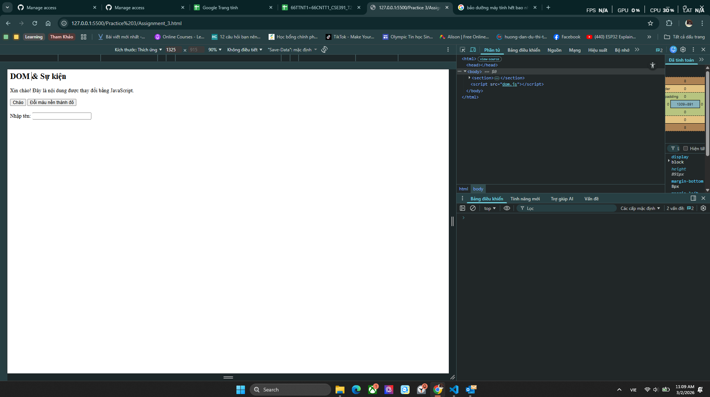
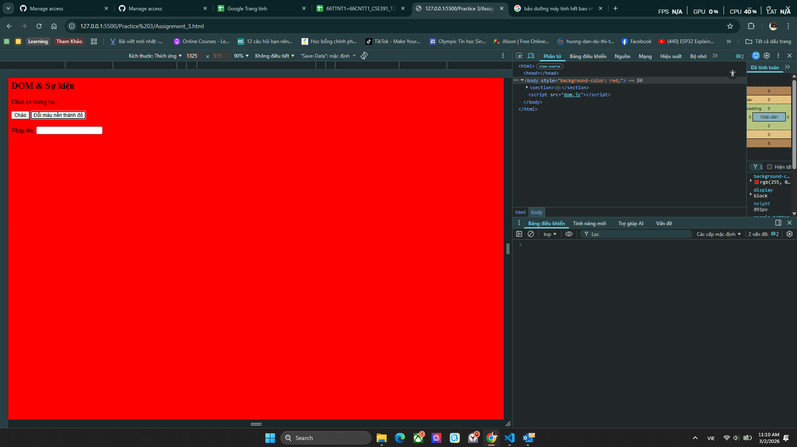
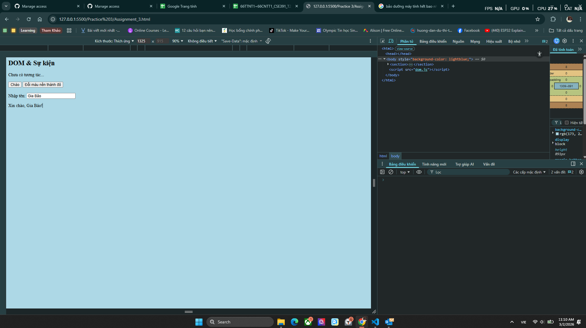

## BTTH03: JS nền tảng, DOM & Sự kiện

**Đối tượng:** Sinh viên chưa học lý thuyết JavaScript

---

## 1. MỤC TIÊU HỌC TẬP

Sau buổi lab, sinh viên có thể:

- Mô tả được JavaScript là gì, chạy ở đâu, khác HTML/CSS ở điểm nào.
- Viết được các đoạn JS đơn giản với:
  - Biến, kiểu dữ liệu cơ bản (number, string, boolean),
  - Cú pháp lệnh, toán tử đơn giản,
  - Cấu trúc điều khiển if/else, vòng lặp đơn giản,
  - Hàm (function) có tham số và giá trị trả về.
- Thao tác được với DOM:
  - Lấy phần tử bằng `document.getElementById`,
  - Thay đổi nội dung văn bản, kiểu dáng (style),
  - Lắng nghe và xử lý một số sự kiện cơ bản: `click`, `input`.
- Nhận biết jQuery là một thư viện hỗ trợ thao tác DOM/sự kiện (ở mức nhận diện, chưa cần sử dụng thành thạo).

---

## 2. CẤU TRÚC THỜI GIAN BUỔI LAB

- 03 tiết thực hành.

---

## 3. HOẠT ĐỘNG 1 (45’): GIỚI THIỆU JS & CÚ PHÁP CƠ BẢN

### 3.1. Chuẩn bị file HTML & JS

Tạo file `lab-js-basic.html`:

```html
<!DOCTYPE html>
<html lang="vi">
  <head>
    <meta charset="UTF-8" />
    <title>Lab JS Cơ bản</title>
  </head>
  <body>
    <h1>Khám phá JavaScript</h1>
    <p id="welcome">Chưa có JavaScript...</p>
    <button id="runBtn">Nhấn để chạy JS</button>

    <script src="main.js"></script>
  </body>
</html>
```

Tạo file `main.js`:

```js
console.log("Hello from JavaScript!");
```

---

### 3.2. Nhiệm vụ cho sinh viên

#### Bước 1: Mở file \& Quan sát bằng Console

1. Mở `lab-js-basic.html` trong trình duyệt (Chrome/Edge/…).
2. Mở DevTools → tab **Console**.
3. Quan sát thông báo xuất hiện.

> Câu hỏi:
>
> - Em thấy dòng thông báo nào trong console?
> - Điều này cho em biết JavaScript đang làm gì khi trang web được tải?
>   Trả lời:
> - Em thấy có dòng thông báo **Hello from JavaScript!**
> - JavaScript chạy các dòng lệnh đã được viết

---

#### Bước 2: “JavaScript là gì?” (Tra cứu nhanh)

Sử dụng 1–2 nguồn tài liệu (vd. W3Schools, freeCodeCamp, …), tóm tắt:

> a) JavaScript chạy ở đâu? (Trình duyệt / Server / Cả hai?)
>
> - JavaScript chạy được ở cả trình duyệt (client-side) và server (server-side).
>   b) HTML, CSS, JavaScript mỗi phần chịu trách nhiệm chính về điều gì?
> - HTML: Tạo cấu trúc nội dung của trang web.
> - CSS: Thiết kế giao diện, màu sắc, bố cục.
> - JavaScript: Xử lý tương tác và logic (sự kiện, thay đổi nội dung, gọi API).

---

#### Bước 3: Thử nghiệm biến \& kiểu dữ liệu trong Console

Trong tab Console, gõ từng dòng sau và ghi lại kết quả:

```js
let age = 20;
const name = "An";
let isStudent = true;

typeof age;
typeof name;
typeof isStudent;

1 + 2 * 3;
"Hello " + "world";
```

> Câu hỏi:
>
> - Kết quả `typeof age` là gì?
> - Kết quả `typeof name` là gì?
> - Kết quả `typeof isStudent` là gì?
> - Em hãy tự mô tả ngắn gọn:
>   - `number` là: ..............................................
>   - `string` là: ..............................................
>   - `boolean` là: ............................................

> Trả lời:
>
> - Kết quả `typeof age` là: "number"
> - Kết quả `typeof name` là: "string"
> - Kết quả `typeof isStudent` là: "boolean"
>   - `number` là: kiểu dữ liệu dùng để lưu số (ví dụ: 1, 20, 3.14).
>   - `string` là: kiểu dữ liệu dùng để lưu văn bản (chuỗi ký tự).
>   - `boolean` là: kiểu dữ liệu chỉ có 2 giá trị: true hoặc false.

---

#### Bước 4: Viết đoạn script tính tuổi

Mở file `main.js`, viết thêm:

```js
let name = "An";
let yearOfBirth = 2005;
let currentYear = 2026;
let age = currentYear - yearOfBirth;

console.log("Xin chào, mình là " + name + ", năm nay mình " + age + " tuổi.");
```

Sau đó:

1. Đổi giá trị `name`, `yearOfBirth` thành thông tin của chính em.
2. Reload trang \& quan sát console.

> Câu hỏi:
>
> - Dòng log hiển thị gì sau khi em sửa thông tin?
> - Nếu em quên dấu `;` hoặc quên dấu `+`, điều gì xảy ra? Trình duyệt báo lỗi thế nào?

> Trả lời:
>
> - Dòng log hiển thị thông tin bao gồm tên và tuổi của em thay vì thông tin ban đầu.
> - Nếu em thiếu dấu `+`, console sẽ hiện báo lỗi `Uncaught SyntaxError: missing ) after argument list (at main.js:8:13)`
> - Nếu em thiếu dấu `+`, chương trình sẽ tự động sửa và thêm dấu ; vào cuối

---

#### Bước 5: Phản tư nhanh (Reflection)

> - Điều thú vị nhất em vừa khám phá được về console là gì?
> - Em gặp lỗi cú pháp nào? Em đã xử lý bằng cách nào (tự sửa, hỏi bạn, đọc lỗi, tìm Google, …)?

> Trả lời
>
> - Console cho phép chạy và thử nghiệm JavaScript trực tiếp, xem kết quả ngay lập tức mà không cần tạo file riêng.
> - Em từng quên dấu + khi nối chuỗi nên bị báo SyntaxError. Em đọc thông báo lỗi trong Console, xem dòng bị lỗi rồi tự sửa lại cho đúng cú pháp.

---

## 4. HOẠT ĐỘNG 2 (40’): CẤU TRÚC ĐIỀU KHIỂN \& HÀM

### 4.1. Chuẩn bị file logic (hoặc viết tiếp trong main.js)

Ví dụ đoạn mã:

```js
// TODO: Đổi giá trị score và quan sát kết quả
let score = 7.5;

// TODO: Dự đoán điều kiện if/else đang làm gì, rồi chạy thử
if (score >= 8) {
  console.log("Giỏi");
} else if (score >= 6.5) {
  console.log("Khá");
} else if (score >= 5) {
  console.log("Trung bình");
} else {
  console.log("Yếu");
}

// TODO: Viết hàm tính điểm trung bình 3 môn
function tinhDiemTrungBinh(m1, m2, m3) {
  let avg = (m1 + m2 + m3) / 3;
  return avg;
}

// Gợi ý dùng thử hàm trong console:
// tinhDiemTrungBinh(8, 7, 9);
```

---

### 4.2. Nhiệm vụ cho sinh viên

#### Bước 1: Đoán trước – chạy sau

> a) Nếu `score = 9`, em dự đoán console sẽ in: Giỏi
> b) Nếu `score = 6`, em dự đoán console sẽ in: Trung bình

Sau đó:

1. Thay `score = 9`, reload trang hoặc chạy file và kiểm tra console.
2. Thay `score = 6`, kiểm tra lại.

> So sánh dự đoán và kết quả thực tế:
>
> - Trường hợp `score = 9`: Dự đoán vs Thực tế: In ra đúng là Giỏi
> - Trường hợp `score = 6`: Dự đoán vs Thực tế: In ra đúng là Trung bình

---

#### Bước 2: Mô tả lại if/else bằng lời

> - Khi nào chương trình in `"Giỏi"`?
> - Khi nào chương trình in `"Yếu"`?
> - Em hãy mô tả cấu trúc `if/else` bằng lời của em (có thể ví von “ngã rẽ” trong đời sống):

> Trả lời:
>
> - Khi biến `score` có lớn hơn hoặc bằng 8, chương trình in ra `"Giỏi"`
> - Khi biến `score` có bé hơn 5, chương trình in ra `"Yếu"`
> - Cấu trúc if/else giống như một ngã rẽ trong cuộc sống.
>   - Nếu điều kiện đúng → mình rẽ theo hướng A.
>   - Nếu điều kiện sai → mình rẽ theo hướng B.
>   - Ví dụ: `“Nếu trời mưa thì mang áo mưa, còn không thì đi bình thường.”`

---

#### Bước 3: Làm việc với hàm

1. Mở Console, gọi hàm:

```js
tinhDiemTrungBinh(8, 7, 9);
```

> Em ghi lại giá trị hàm trả về: 8

2. Viết thêm hàm `xepLoai(avg)` trong file JS:

```js
function xepLoai(avg) {
  // TODO: Dùng if/else để:
  // avg >= 8  -> "Giỏi"
  // avg >= 6.5 -> "Khá"
  // avg >= 5  -> "Trung bình"
  // còn lại   -> "Yếu"
}
```

3. Gọi thử trong console:

```js
let avg = tinhDiemTrungBinh(8, 7, 9);
let loai = xepLoai(avg);
console.log("Điểm TB:", avg, " - Xếp loại:", loai);
```

> Câu hỏi:
>
> - Một hàm gồm những phần chính nào?
>   - Tên hàm: .................................................
>   - Tham số (parameters): ....................................
>   - Thân hàm (body): .........................................
>   - Giá trị trả về (return): .................................
> - Ưu điểm của việc dùng hàm thay vì lặp lại cùng một đoạn code nhiều lần là gì?

> Trả lời:
>
> - Một hàm gồm những phần chính nào?
>   - Tên hàm: Là tên để gọi và sử dụng lại hàm (giúp phân biệt với hàm khác).
>   - Tham số (parameters): Là dữ liệu đầu vào được truyền vào hàm để xử lý.
>   - Thân hàm (body): Là phần chứa các câu lệnh thực hiện công việc của hàm.
>   - Giá trị trả về (return): Là kết quả mà hàm trả lại sau khi xử lý.
> - Ưu điểm của việc dùng hàm thay vì lặp lại cùng một đoạn code nhiều lần là
>   - Tránh lặp lại cùng một đoạn code nhiều lần.
>   - Code gọn, dễ đọc hơn.
>   - Dễ sửa lỗi.
>   - Có thể tái sử dụng nhiều lần.

---

#### Bước 4: Mở rộng nhỏ (tuỳ chọn)

Viết hàm `kiemTraTuoi(age)`:

```js
function kiemTraTuoi(age) {
  // TODO:
  // Nếu age >= 18 -> console.log("Đủ 18 tuổi");
  // Ngược lại -> console.log("Chưa đủ 18 tuổi");
}
```

Gọi thử: `kiemTraTuoi(16);`, `kiemTraTuoi(20);`.

---

#### Bước 5: Phản tư

> - Phần nào trong if/else hoặc hàm khiến em khó hiểu nhất?
> - Em đã làm gì để vượt qua (thử nhiều lần, hỏi bạn, xem lại ví dụ, tra Google, …)?

> Trả lời:
>
> - Em không thấy phần nào khiến em khó hiểu cả.
> - Em đã thử, dùng và làm qua rất nhiều hàm, điều kiện để quen tay hơn.

---

## 5. HOẠT ĐỘNG 3 (40’): THAO TÁC DOM \& SỰ KIỆN

### 5.1. Chuẩn bị HTML

Thêm vào trang (hoặc tạo file mới):

```html
<section>
  <h2>DOM & Sự kiện</h2>
  <p id="status">Chưa có tương tác...</p>

  <button id="btnHello">Chào</button>
  <button id="btnRed">Đổi màu nền thành đỏ</button>

  <div style="margin-top: 20px;">
    <label>Nhập tên: </label>
    <input id="nameInput" type="text" />
    <p id="greeting"></p>
  </div>
</section>

<script src="dom.js"></script>
```

Tạo file `dom.js`:

```js
const statusEl = document.getElementById("status");
const btnHello = document.getElementById("btnHello");

btnHello.addEventListener("click", function () {
  statusEl.textContent =
    "Xin chào! Đây là nội dung được thay đổi bằng JavaScript.";
});
```

---

### 5.2. Nhiệm vụ cho sinh viên

#### Bước 1: Đọc \& giải thích

> Câu hỏi:
>
> - `document.getElementById("status")` đang làm gì?
> - Sự kiện `"click"` xảy ra khi nào?
> - Trong đoạn code trên, khi nhấn nút `btnHello`, điều gì thay đổi trên trang?

> Trả lời:
>
> - `document.getElementById("status")` đang tìm trong HTML một phần tử có `id="status"` và trả về phần tử đó để JavaScript có thể thao tác
> - Sự kiện `"click"` xảy ra khi người dùng ấn vào nút `"chào"` trên trang (tương ứng với nút có id `"btnHello"` )
> - Trong đoạn code trên, khi nhấn nút `btnHello`, nội dung của thẻ `"<p id="status">"`sẽ được thay đổi từ `"Chưa có tương tác..."` thành `"Xin chào! Đây là nội dung được thay đổi bằng JavaScript."`

---

#### Bước 2: Thử nghiệm nút đổi màu nền

Hoàn thiện code:

```js
const btnRed = document.getElementById("btnRed");

btnRed.addEventListener("click", function () {
  // TODO: Đổi màu nền trang thành đỏ
  document.body.style.backgroundColor = "red";
});
```

> Câu hỏi:
>
> - Em có thể đổi sang màu khác (vd. `lightblue`) không? Hãy thử.
> - Em hãy ghi lại 1 ví dụ khác mà JavaScript có thể làm với `document.body.style`.

> Trả lời
>
> - Em đổi `"red"` thành `"lightblue"`(hoặc một màu bất kỳ nào khác) thì khi tải lại trang và tương tác với nút `btnRed` thì nó sẽ đổi sang màu khác
> - Em có thể đổi font của một trang bằng câu lệnh
>   `document.body.style.fontFamily = "Arial";`

---

#### Bước 3: Xử lý sự kiện input – gõ tên, hiện lời chào

Hoàn thiện code:

```js
const nameInput = document.getElementById("nameInput");
const greeting = document.getElementById("greeting");

nameInput.addEventListener("input", function () {
  const value = nameInput.value;
  greeting.textContent = "Xin chào, " + value + "!";
});
```

> Câu hỏi:
>
> - Sự kiện `"input"` khác gì so với `"click"`?
> - Khi em xoá hết nội dung ô input, dòng `greeting` hiển thị gì?

> Trả lời:
>
> - Sự kiện `"input"` và `"click"` khác nhau ở điểm:
>   - `"click"` xảy ra khi người dùng nhấn chuột vào một phần tử (ví dụ: button).
>   - `"input"` xảy ra ngay khi nội dung trong ô `<input> ` thay đổi.
> - Khi em xoá hết nội dung ô input, dòng `greeting` chỉ còn hiển thị dòng chữ `"Xin chào, "`

---

#### Bước 4: Liên hệ khái niệm DOM

> DOM (Document Object Model) là mô hình biểu diễn trang HTML dưới dạng một **cây các đối tượng** mà JavaScript có thể truy cập và thay đổi.
>
> Em hãy:
>
> - Tự mô tả DOM bằng lời của em:
>   ................................................................
> - Nêu 1 ví dụ “thao tác DOM” trong bài (ghi lại 1 dòng lệnh cụ thể).

> Trả lời:
>
> - DOM là cách trình duyệt biến toàn bộ trang HTML thành một “cây” gồm nhiều phần tử, để JavaScript có thể truy cập, đọc và thay đổi nội dung hoặc giao diện của từng phần tử đó.
> - Ví dụ:

## `statusEl.textContent = "Xin chào! Đây là nội dung được thay đổi bằng JavaScript.";`

#### Bước 5: Ảnh kết quả

Hãy chụp các ảnh màn hình:

1. Khi vừa tải trang (chưa tương tác).
2. Sau khi nhấn “Chào”.
3. Sau khi đổi nền sang màu đỏ.
4. Khi gõ tên và nhìn thấy lời chào xuất hiện.

_(Ảnh có thể được yêu cầu nộp cùng bài hoặc dán vào báo cáo)_


_Hình 1: Ảnh khi vừa tải trang_

_Hình 1: Ảnh sau khi nhấn “Chào”_

_Hình 1: Ảnh sau khi đổi nền sang màu đỏ_

_Hình 1: Ảnh khi gõ tên và nhìn thấy lời chào xuất hiện_

## 6. KẾT THÚC (15’): GIỚI THIỆU JQUERY \& PHẢN TƯ

### 6.1. Nhìn nhanh jQuery (so sánh với JS thuần)

Ví dụ:

```js
// JS thuần
document.getElementById("btnHello").addEventListener("click", function () {
  alert("Hello from JS!");
});

// jQuery (giả sử đã import jQuery)
$("#btnHello").on("click", function () {
  alert("Hello from jQuery!");
});
```

> Câu hỏi:
>
> - Điểm giống nhau về chức năng giữa 2 đoạn code trên là gì?
> - Điểm khác nhau về cú pháp là gì (`document.getElementById` vs `$("#id")`, `addEventListener` vs `.on`)?
> - Em hãy tra cứu nhanh “What is jQuery used for?” và ghi 2 ý chính:
>   1. ................................................................
>   2. ................................................................

> Trả lời
>
> - Điểm giống nhau về chức năng giữa 2 đoạn code trên là đều xử lý sự kiện `click`
> - Điểm khác nhau về cú pháp (`document.getElementById` vs `$("#id")`, `addEventListener` vs `.on`) là:
>   - JS:
>     - Chọn phần tử: document.getElementById("btnHello")
>     - Gắn sự kiện: .addEventListener("click", ...)
>   - jQuery:
>     - Chọn phần tử: $("#btnHello") (ngắn gọn hơn)
>     - Gắn sự kiện: .on("click", ...)
>   1. Đơn giản hóa việc thao tác DOM (chọn phần tử, thay đổi nội dung, CSS).
>   2. Xử lý sự kiện, hiệu ứng và AJAX dễ dàng hơn, đặc biệt là hỗ trợ tương thích nhiều trình duyệt.

---

### 6.2. Tự đánh giá \& định hướng

> 1. Sau buổi lab, em tò mò nhất về phần nào của JavaScript/DOM?
>
> - Em tò mò nhất về cách JavaScript có thể thay đổi DOM theo thời gian thực (ví dụ: cập nhật nội dung ngay khi người dùng nhập liệu hoặc bấm nút).
>
> 2. Em muốn tự làm thêm tính năng gì trên trang web (vd: bộ đếm, đổi theme, pop-up, mini game, …)?
>
> - Em muốn làm thêm một tính năng đổi theme sáng/tối (dark mode) và một bộ đếm số lần nhấn nút.
>
> 3. Em đánh giá mức độ hiểu của mình về:
>    - Biến \& kiểu dữ liệu: [ ] Chưa hiểu [ ] Tạm ổn [✔] Khá rõ
>    - If/else \& hàm: [ ] Chưa hiểu [ ] Tạm ổn [✔] Khá rõ
>    - DOM \& sự kiện: [ ] Chưa hiểu [ ] Tạm ổn [✔] Khá rõ

---

## 7. GHI CHÚ CHO GIẢNG VIÊN (NỘI BỘ)

- Có thể cho SV làm theo cặp/nhóm 2–3 để hỗ trợ nhau thử nghiệm, đọc lỗi, tra cứu.
- Tùy thời lượng thực tế, có thể:
  - Giảm bớt phần mở rộng (hàm `kiemTraTuoi`, tuỳ biến thêm hiệu ứng).
  - Hoặc tăng thêm bài tập DOM (ẩn/hiện một khối, đếm số lần click, v.v.).
- Phiếu học tập tiếp theo có thể chi tiết hóa từng hoạt động thành form trả lời, chỗ dán ảnh, và câu hỏi mini test trắc nghiệm.
